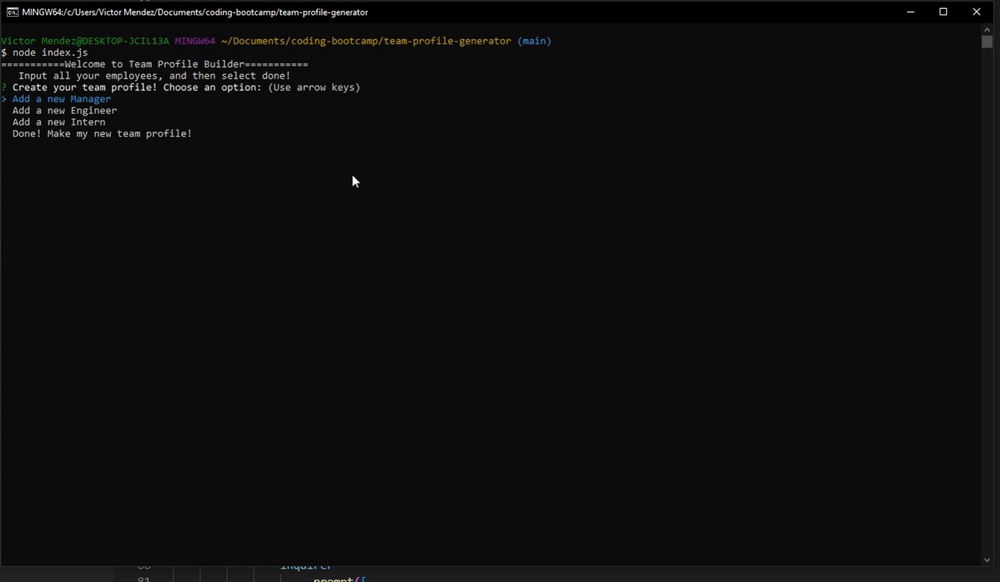
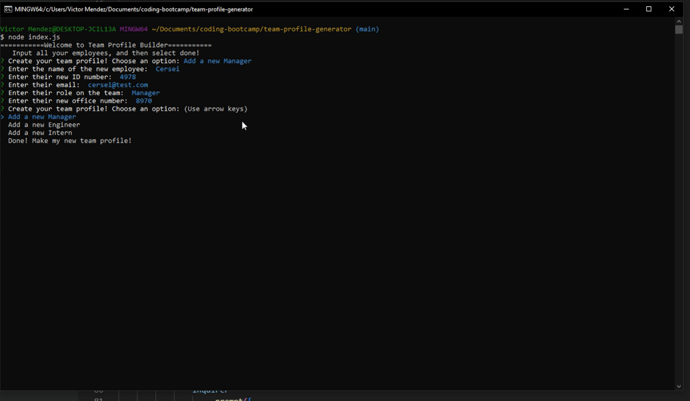
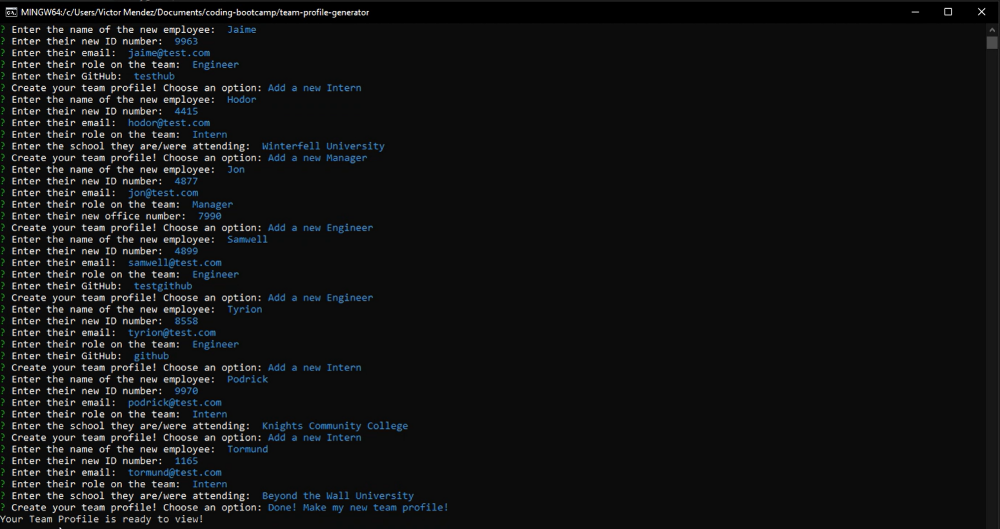
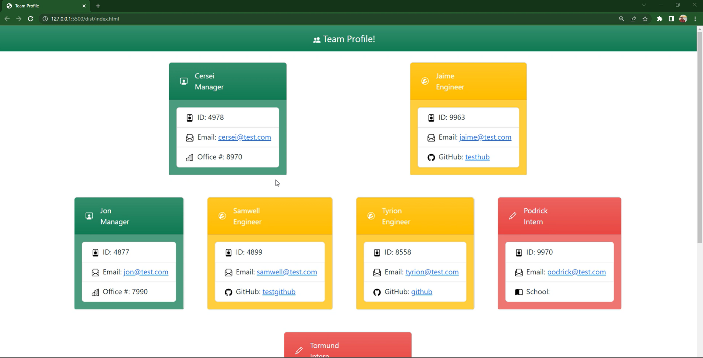

# Team Profile Generator

## Table of Contents
- [Description](#Description)
- [Installation](#Installation)
- [Usage](#Usage)
- [Tests](#Tests)
- [Questions](#Questions)

## Description
#### User Story 

AS A manager
I WANT to generate a webpage that displays my team's basic info
SO THAT I have quick access to their emails and GitHub profiles

#### Acceptance Criteria

GIVEN a command-line application that accepts user input
WHEN I am prompted for my team members and their information
THEN an HTML file is generated that displays a nicely formatted team roster based on user input
WHEN I click on an email address in the HTML
THEN my default email program opens and populates the TO field of the email with the address
WHEN I click on the GitHub username
THEN that GitHub profile opens in a new tab
WHEN I start the application
THEN I am prompted to enter the team manager’s name, employee ID, email address, and office number
WHEN I enter the team manager’s name, employee ID, email address, and office number
THEN I am presented with a menu with the option to add an engineer or an intern or to finish building my team
WHEN I select the engineer option
THEN I am prompted to enter the engineer’s name, ID, email, and GitHub username, and I am taken back to the menu
WHEN I select the intern option
THEN I am prompted to enter the intern’s name, ID, email, and school, and I am taken back to the menu
WHEN I decide to finish building my team
THEN I exit the application, and the HTML is generated

## Installation
Download program to your computer > Open a terminal and go into program folder > run a 'npm i' to install all dependencies

## Usage
Once you have installed the program. Run a 'node index.js' in your terminal while in the program folder. The program will begin and you will see the menu. Add as many employees as necessary and then choose done. You will be notified when the team profile has been generated. You can retrieve the HTML file from the dist/ folder. For more details, watch my tutorial provided below! 

## Application Screenshots

## Tests
Tests were created with jest. After the program has been installed you can run the command 'jest' from the terminal in the program folder for testing. See tests demo below!

## Application Links
[GitHub](https://github.com/VictorMendez96/team-profile-generator)

[Jest Testing Video Walk-through](https://drive.google.com/file/d/1bYiwVbsGFVPgoRxs1rfJYRMVNjxCpDdi/view)
[Program Video Walk-through](https://drive.google.com/file/d/1GlUPmDELzNFoMjaaNpwdIRG5cHypWRMv/view)
